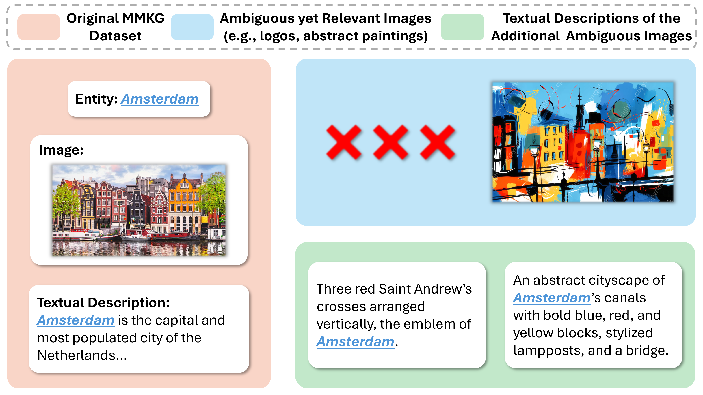
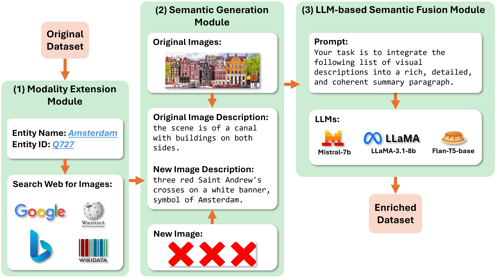
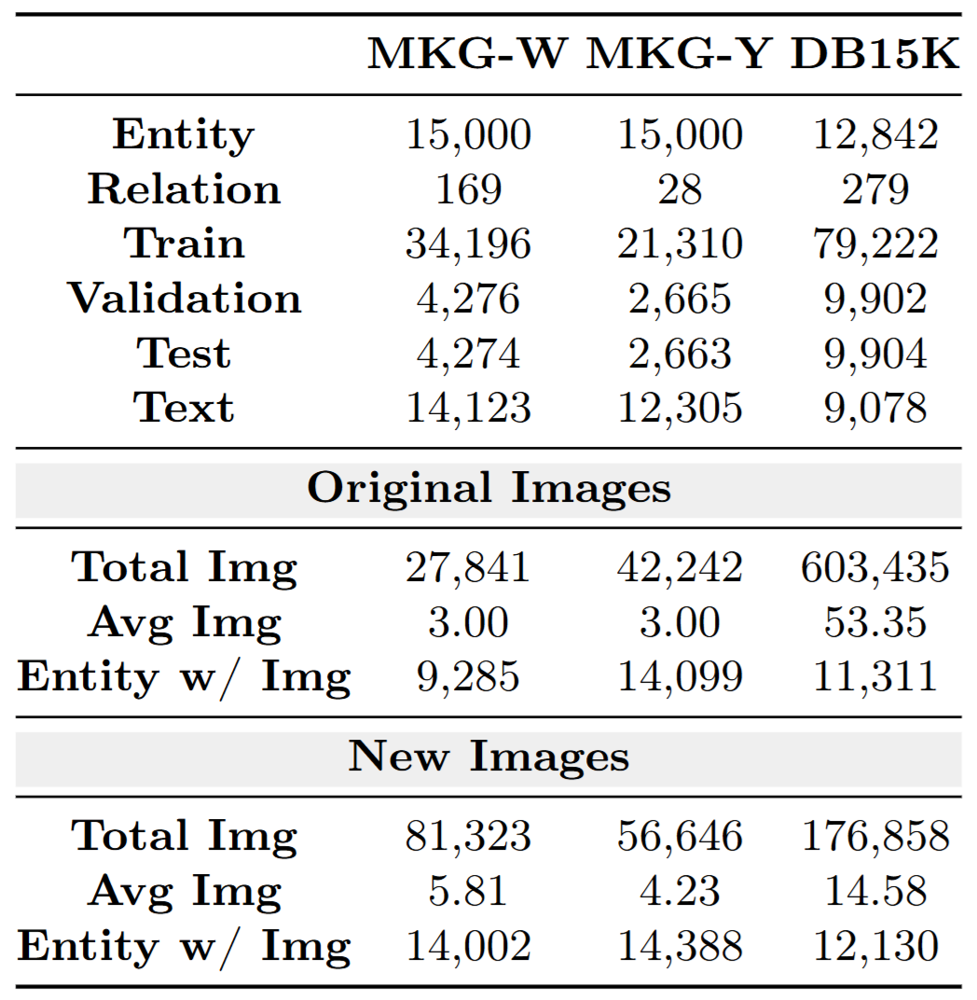
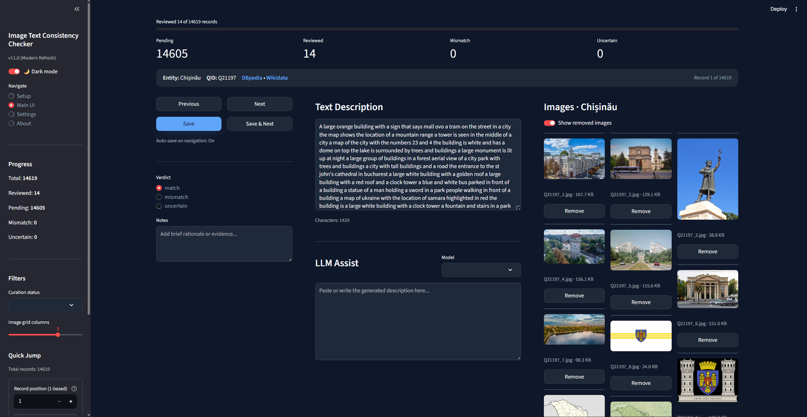

# Beyond-Images: Multi-Modal Knowledge Graph Dataset Enrichment

<p align="center"><em>Are a thousand words better than a single picture?</em></p>

<p align="center">
  <a href="https://github.com/pengyu-zhang/Beyond-Images/blob/main/Supplementary_Material.pdf">
    
  </a>
  <a href="https://github.com/pengyu-zhang/Beyond-Images/blob/main/video%20demo/video%20demo.mp4">
    
  </a>
  
</p>

<div align="center">
  
</div>

## Table of Contents
- [Overview](#overview)
- [Highlights](#highlights)
- [Repository Structure](#repository-structure)
- [Getting Started](#getting-started)
- [Data](#data)
- [Pipeline](#pipeline)
- [Reproducing Results](#reproducing-results)
- [Results](#results)
- [Resources](#resources)
- [Citation](#citation)
- [Contact](#contact)

## Overview
**Beyond-Images** is an automated framework that augments multi-modal knowledge graphs (MMKGs) with textual descriptors distilled from images. Many MMKG images are ambiguous or noisy; we bridge this gap by generating image-grounded descriptions, summarising them with large language models (LLMs), and filtering irrelevant content before reinjecting the enriched semantics back into the graph.

The framework supports:
- automatic retrieval of additional images for each entity,
- image-to-text captioning tailored for noisy visual inputs,
- LLM-based summarisation and denoising to yield concise, entity-aligned descriptions,
- downstream evaluation on three public MMKG benchmarks with four representative models.

In our experiments, Beyond-Images lifts link prediction performance by up to **+7% Hits@1**, underscoring the value of language as a semantic bridge when visual information is unreliable.

## Highlights
- **Plug-and-play enrichment**: Integrates seamlessly with existing MMKG models without requiring architectural changes.
- **Noise-aware fusion**: Uses LLM reasoning to reconcile conflicting captions and discard off-topic content.
- **Scalable pipeline**: Automates retrieval, captioning, summarisation, and embedding generation for millions of images.
- **Demonstrated gains**: Consistent performance improvements across FB15k-237, DB15K, and MKG benchmarks.

## Repository Structure
```text
.
|-- code/                # Source code for data processing, captioning, summarisation, and evaluation
|-- dataset/             # Sample data artefacts (full release to follow paper acceptance)
|-- fig/                 # Figures used in the paper and README
|-- video demo/          # Project walkthrough video
|-- run.sh               # Example SLURM script orchestrating the pipeline
`-- requirements.txt     # Python dependencies (tested with Python 3.11)
```

## Getting Started

### Prerequisites
- Python 3.11 (recommend managing environments with Conda or mamba)
- CUDA-enabled GPU for large-scale captioning and model fine-tuning
- Access to the required MMKG datasets (see [Data](#data))

### Installation
```bash
conda create -n beyondimages311 -y python=3.11
conda activate beyondimages311
pip install -r requirements.txt
```

If your workflow relies on the SLURM example in `run.sh`, adapt the environment activation lines to your cluster configuration.

## Data

| Resource | Size | Notes |
| --- | --- | --- |
| Full Beyond-Images datasets | ~23 GB | Contains raw images and generated descriptions. Public release planned after paper acceptance. |
| Sample subset (`dataset/img_text_summary.zip`) | 4.16 MB | Minimal example for reproducing the pipeline locally. |

Update the paths in the scripts under `code/` to point to your dataset location. For large-scale experiments, ensure sufficient storage for intermediate captions and embeddings.

## Pipeline
<div align="center">
  
</div>

1. **Image Retrieval** - Expand entity coverage with web-scale image search.
2. **Caption Generation** - Produce dense, entity-aware descriptions via BLIP-2 and related models.
3. **LLM Fusion** - Summarise multiple captions, remove noise, and align with KG context.
4. **Embedding & Integration** - Convert final descriptions to text embeddings and feed them to MMKG models.

<div align="center">
  
</div>

## Reproducing Results

1. Configure dataset locations in the scripts under `code/`.
2. Launch the end-to-end pipeline (example SLURM command shown below):
   ```bash
   bash run.sh
   ```
3. Inspect generated captions, summaries, and embeddings under the designated output folders.
4. Train and evaluate your chosen MMKG model using the enriched data.

Adjust `run.sh` for your cluster (GPU type, walltime, environment modules). Individual pipeline stages can also be executed manually; see the script for ordering.

## Results
<div align="center">
  
</div>

<div align="center">
  
</div>

## Resources
- [Supplementary Material](https://github.com/pengyu-zhang/Beyond-Images/blob/main/Supplementary_Material.pdf)
- [Video Demo](https://github.com/pengyu-zhang/Beyond-Images/blob/main/video%20demo/video%20demo.mp4)

## Citation
If you find this repository useful, please cite our work (BibTeX pending public release).

```
@inproceedings{beyond2025images,
  title     = {Beyond-Images: Multi-Modal Knowledge Graph Dataset Enrichment},
  author    = {Zhang, Pengyu and collaborators},
  booktitle = {Proceedings of the TBD Conference},
  year      = {2025},
  note      = {Preprint}
}
```

## Contact
For questions or collaborations, please open an issue or reach out to the maintainers via the email addresses listed in the paper.
