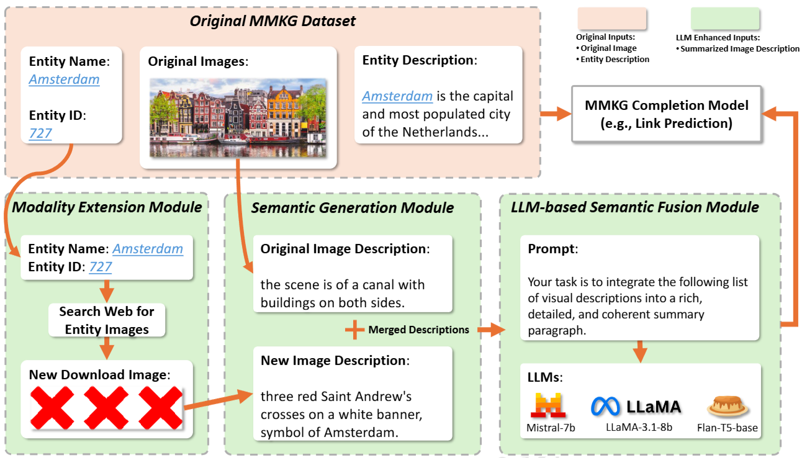
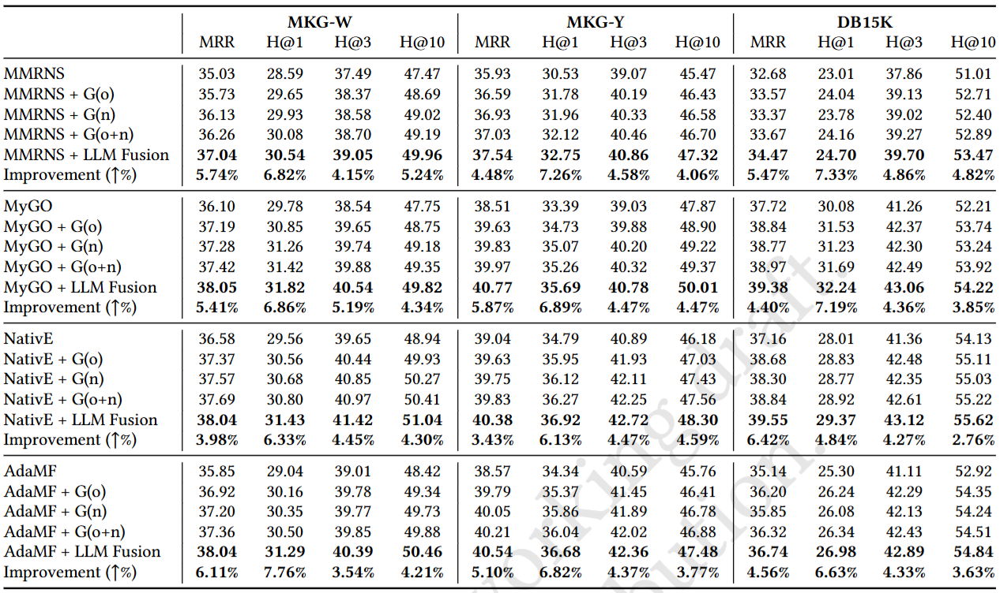

# Beyond-Images
Is a Thousand Words Worth One Picture?

Beyond Images - A Framework for Multi-Modal Knowledge Graph Dataset Enrichment

# Supplementary Material

[Supplementary Material](https://github.com/pengyu-zhang/Beyond-Images/blob/main/Supplementary_Material.pdf)

<br><br>
<div align="center">

</div>
<br><br>

Multi-Modal Knowledge Graphs (MMKGs) enhance entity representations by incorporating text, images, audio, and video, offering a more comprehensive understanding of each entity. Among these modalities, images are especially valuable due to their rich content and the ease of large-scale collection. However, many images are semantically unclear, making it challenging for the models to effectively use them to enhance entity representations. For example, symbolic logos or abstract paintings often consist of simple shapes and lines with unclear semantics, making it harder for the model to distinguish between similar images. To address this problem, we present the Beyond Images framework, which generates textual descriptions for entity images to more effectively capture their semantic relevance to the associated entity. By adding textual descriptions, we achieve up to 5% improvement in Hits@1 for link prediction task across three MMKG datasets. Furthermore, our scalable framework reduces the need for manual construction by automatically extending three MMKG datasets with additional images and their descriptions. Our work highlights the importance of textual descriptions in MMKGs, not only those directly associated with entities, but also those generated from entities' images. This additional semantic information plays a key role in improving entity representations and overall model performance.

## Usage

Please follow the instructions next to reproduce our experiments, and to train a model with your own data.

### 1. Install the requirements

Creating a new environment (e.g. with `conda`) is recommended. Use `requirements.txt` to install the dependencies:

```
conda create -n beyondimages311 -y python=3.11 && conda activate beyondimages311
pip install -r requirements.txt
```

### 2. Download the data

| Download link                                                | Size |
| ------------------------------------------------------------ | ----------------- |
| Our full dataset (https://drive.google.com/file/d/1EZ7l3xktCBAwsCM7jBrWiKuS2QKDkVs_/view?usp=sharing) | 22 GB (includes raw images)            |
| Small example dataset: img_text_summary.zip | 4.16 MB            |

### 3. Reproduce the experiments

```
bash run.sh
```
<br><br>
<div align="center">

</div>
<br><br>

