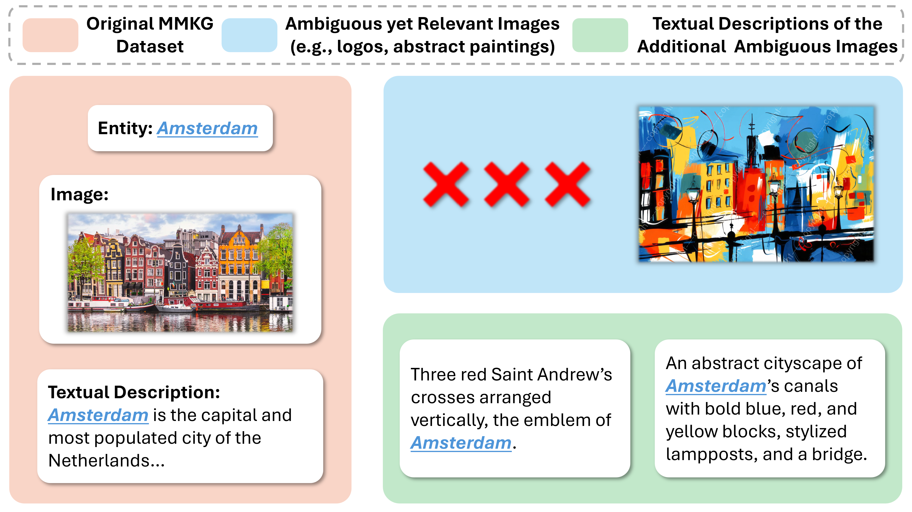
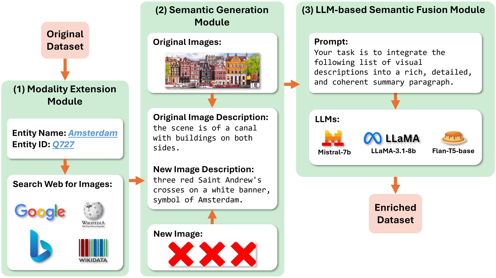

# Beyond Images

<p align="center"><em>Are a thousand words better than a single picture?</em></p>

<p align="center">
  <a href="https://pengyu-zhang.github.io/Beyond-Images/">
    </a>
  <a href="https://doi.org/10.1007/978-3-032-25156-5_5">
    </a>
  <a href="https://pengyu-zhang.github.io/pdf/Beyond_Images.pdf">
    </a>
  <a href="supplementary_material/Supplementary_Material.pdf">
    </a>
  <a href="video_demo/video_demo.mp4">
    </a>
</p>

Official implementation of **"Are a Thousand Words Better Than a Single
Picture? Beyond Images – A Framework for Multi-Modal Knowledge Graph Dataset
Enrichment"** (ESWC 2026).

> Pengyu Zhang, Klim Zaporojets, Jie Liu, Jia-Hong Huang, Paul Groth.

<div align="center">
  
</div>

## Overview

Beyond Images is an automatic, data-centric enrichment pipeline for
multi-modal knowledge graphs (MMKGs). Many entity images — logos, symbols,
abstract scenes — are *ambiguous yet relevant*: visual embeddings extract
little usable signal from them. Beyond Images converts visual content into
language instead. It (1) retrieves additional entity images at scale from
Wikipedia, (2) generates textual descriptions for all original and new
images with image-to-text models (BLIP-2, GIT, LLaVA), and (3) fuses the
multi-source descriptions into one concise, entity-aligned summary with an
LLM (Mistral-7B, Llama-3.1-8B, Flan-T5).

The fused summaries plug into standard MMKG completion models (MMRNS, MyGO,
NativE, AdaMF) as an enhanced text modality — no architecture or loss
changes — and improve link prediction by up to **+7% Hits@1** across three
public benchmarks, with gains up to **+333% Hits@1** on entities whose
images are logos or symbols (see the [paper](https://doi.org/10.1007/978-3-032-25156-5_5)
for full results). An interactive **Image-Text Consistency Checker**
supports optional human auditing of the generated summaries — try the
[live demo](https://pengyu-zhang.github.io/Beyond-Images/).

<div align="center">
  
</div>

## Repository structure

```text
.
├── src/beyond_images/      # Pipeline package
│   ├── retrieval/          #   (1) Modality Extension: QID alignment, image crawling
│   ├── captioning/         #   (2) Semantic Generation: BLIP-2 / GIT / LLaVA
│   ├── fusion/             #   (3) LLM-based Semantic Fusion: Flan-T5 / Mistral / Llama
│   └── embedding/          #   (4) Exports for downstream models (.h5 / .pth / tokens)
├── configs/                # original.yaml · paper.yaml · default.yaml · smoke.yaml
├── scripts/                # setup_env, prepare_data, run_pipeline, run_all, smoke_test
├── tools/checker/          # Image-Text Consistency Checker (Streamlit)
├── index.html + demo/      # Browser live demo of the checker (GitHub Pages)
├── data/                   # Dataset docs + bundled sample (bodies are git-ignored)
├── docs/REFACTORING_NOTES.md
└── original_code/          # As-published scripts, archived unchanged
```

## Getting started

Requirements: Python ≥ 3.10 and (optionally) a CUDA GPU. Every stage also
runs on CPU.

```bash
git clone https://github.com/pengyu-zhang/Beyond-Images.git
cd Beyond-Images
bash scripts/setup_env.sh          # CUDA_TAG=cu132 by default; CUDA_TAG=cpu for CPU-only
```

Verify everything end-to-end in a few minutes (uses the bundled sample and
small ungated models):

```bash
bash scripts/smoke_test.sh
```

## Data

The enriched datasets (per-image captions and per-entity descriptions for
MKG-W, MKG-Y, DB15K) are released on
[Zenodo](https://doi.org/10.5281/zenodo.14847095) (CC-BY-4.0), mirrored as
a GitHub Release asset, and hosted on
[Hugging Face](https://huggingface.co/datasets/pengyu3/beyond-images-enriched)
with a browsable data viewer:

```bash
bash scripts/prepare_data.sh       # download (~128 MB), verify MD5, extract
```

```python
from datasets import load_dataset   # or load directly from the Hub
captions = load_dataset("pengyu3/beyond-images-enriched", "captions")
```

Re-running the pipeline from scratch additionally needs the source MMKG
datasets — see [data/README.md](data/README.md) for sources and layout.

## Running the pipeline

One command per dataset (crawl → caption → fuse → export, resume-safe):

```bash
bash scripts/run_all.sh MKG-W                          # recommended config
CONFIG=configs/paper.yaml bash scripts/run_all.sh MKG-W  # paper models (large GPU)
```

Or run stages individually with any config and per-key overrides:

```bash
bash scripts/run_pipeline.sh fuse \
    --inputs data/processed/img_text_summary/MKG-W_original_img_summary_blip.json \
             data/processed/img_text_summary/MKG-W_img_new_summary_blip.json \
    --journal outputs/MKG-W/fuse.jsonl --output outputs/MKG-W/MKG-W_fused.json \
    --set fusion.model=mistralai/Mistral-7B-Instruct-v0.3 --set fusion.quantization=4bit
```

Configuration tiers:

| Config | Purpose |
| --- | --- |
| `configs/default.yaml` | Recommended. Runs on an 8 GB GPU, no gated models. |
| `configs/paper.yaml` | Paper setting: blip2-flan-t5-xxl + Mistral-7B-Instruct-v0.3. |
| `configs/original.yaml` | Regression baseline reproducing the archived scripts' behaviour. |

## Expected output

For each dataset the pipeline produces (under `outputs/<DATASET>/`):

- `new_images_metadata.json` — provenance for every crawled image (page URL, image URL, author/date/license),
- `*_img_summary.json` — per-entity caption sets with `merged_descriptions`,
- `*_fused.json` — one LLM-fused summary per entity,
- `*_description_sentences.h5`, `*-textual.pth` (+ row manifest), `*-tokens.json` —
  drop-in text inputs for [MMRNS](https://github.com/quqxui/MMRNS),
  [AdaMF](https://github.com/zjukg/AdaMF-MAT), [NativE](https://github.com/zjukg/NATIVE),
  and [MyGO](https://github.com/zjukg/MyGO).

Downstream link prediction is run in those model repositories with their
default hyperparameters, swapping in the enriched text files.

## Human auditing

```bash
streamlit run tools/checker/app.py
```

The checker shows each entity's fused summary next to its full image set
for Match / Mismatch / Uncertain verdicts, with notes, soft image removal,
and JSON export ([details](tools/checker/README.md)). A browser-only
preview with bundled examples is hosted at
**<https://pengyu-zhang.github.io/Beyond-Images/>**.

## Citation

```bibtex
@inproceedings{zhang2026beyond,
  title     = {Are a Thousand Words Better Than a Single Picture? Beyond Images --
               A Framework for Multi-Modal Knowledge Graph Dataset Enrichment},
  author    = {Zhang, Pengyu and Zaporojets, Klim and Liu, Jie and Huang, Jia-Hong and Groth, Paul},
  booktitle = {The Semantic Web -- ESWC 2026},
  publisher = {Springer},
  year      = {2026},
  doi       = {10.1007/978-3-032-25156-5_5}
}
```

## Notes

`original_code/` archives the scripts exactly as first published; all
differences between them and the current pipeline are documented in
[docs/REFACTORING_NOTES.md](docs/REFACTORING_NOTES.md).

Maintained by [Pengyu Zhang](https://pengyu-zhang.github.io/).
